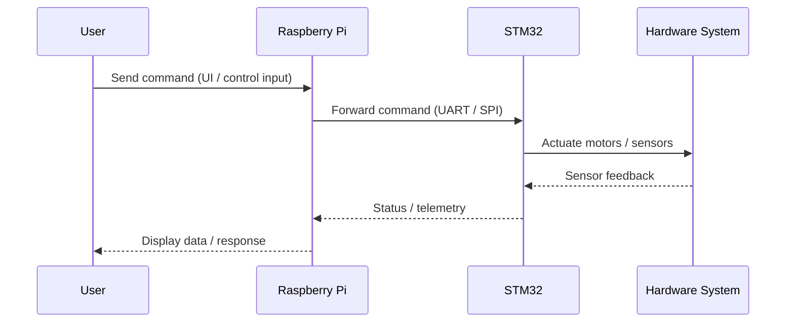

```mermaid
sequenceDiagram
    participant U as User
    participant RPI as Raspberry Pi
    participant STM as STM32
    participant HW as Hardware System

    U->>RPI: Send command (UI / control input)
    RPI->>STM: Forward command (UART / SPI)
    STM->>HW: Actuate motors / sensors
    HW-->>STM: Sensor feedback
    STM-->>RPI: Status / telemetry
    RPI-->>U: Display data / response
```
